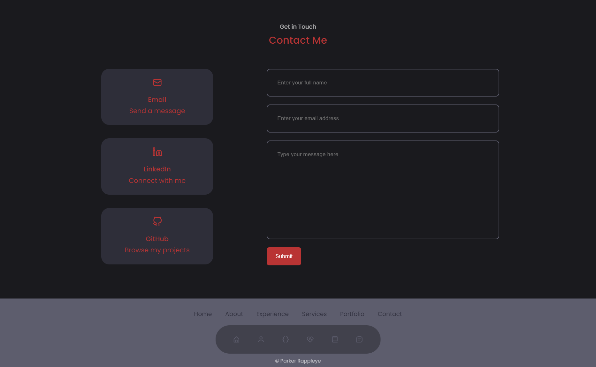

# Parker's Portfolio

## Overview
Welcome to my portfolio! This repository hosts the code for my single-page application portfolio deployed on Heroku. You can explore my recent projects, learn about my skills and experiences, and get in touch with me through the contact form.

[Check out my Portfolio](https://parker-rappleye-portfolio-3e446a2b2490.herokuapp.com)

## Table of Contents
- [Overview](#overview)
- [Technologies Used](#technologies-used)
- [Features](#features)
- [License](#license)
- [Contributing](#contributing)
- [Questions](#questions)

## Technologies Used

- React
- React Router
- HTML
- CSS

## Features

### Header and Resume Section
- My name is displayed in the header.
- Includes a downloadable link to my resume.
- Lists my skills and proficiencies.

### About Me Section
- Includes a recent photo or avatar of me.
- Contains a short bio about me and my background.

### Portfolio Section
- Displays titled images of six projects I've completed.
- Links to deployed applications and corresponding GitHub repositories.

### Contact Section
- Includes a contact form with fields for name, email address, and message.
- Provides notifications for required fields and invalid email addresses.

### Footer and Navigation
- Contains text or icon links to my GitHub, LinkedIn, and another platform profile.
- Navigation links include About Me, Portfolio, Contact, and Resume.
- Current section title is highlighted.

## License

This project is licensed under the [MIT License](./LICENSE).

## Contributing

This project is not open for contributions as it represents my personal portfolio. However, I appreciate feedback and suggestions for improvement.

## Questions
For questions about this project, contact [Parker Rappleye](https://github.com/prappleman) via email at parker.rappleye1@gmail.com.
